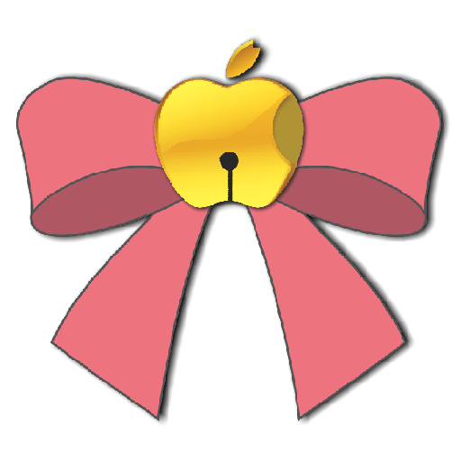

# Ourin /  桜鈴

Macネイティブの伺かベースウェア

---

## 📄 License / ライセンス

This project is licensed under the
[Creative Commons Attribution-NonCommercial-ShareAlike 4.0 International (CC BY-NC-SA 4.0)](https://creativecommons.org/licenses/by-nc-sa/4.0/).

このプロジェクトは
[クリエイティブ・コモンズ 表示-非営利-継承 4.0 国際ライセンス（CC BY-NC-SA 4.0）](https://creativecommons.org/licenses/by-nc-sa/4.0/deed.ja)
のもとで提供されています。

---

### ✅ You are free to / 許可されていること

- **Share / 共有**: 複製・再配布できます  
- **Adapt / 改変**: リミックス・改変・派生利用ができます

As long as you follow these terms:  
以下の条件を守る限りにおいて：

- **Attribution / 表示**: 適切なクレジットの表示が必要です  
- **NonCommercial / 非営利**: 営利目的での利用は禁止されています  
- **ShareAlike / 継承**: 改変後も同一ライセンスでの公開が必要です

---

### 💼 Commercial Use / 商用利用について

If you wish to use this work for **commercial purposes**,  
please contact one of the copyright holders below.

この作品を**商用利用したい場合**は、以下の著作権者にご連絡ください。

#### 📧 Contact / 連絡先

- **eightman**： [eight@eightman999.com](mailto:eight@eightman999.com)  
- **風鈴ラボ / Furin Lab**： [contact@furinlab.com](mailto:contact@furinlab.com)

---

## 🔗 License Link / ライセンスリンク

- [Full License Text (EN)](https://creativecommons.org/licenses/by-nc-sa/4.0/legalcode)  
- [ライセンス全文（日本語訳）](https://creativecommons.org/licenses/by-nc-sa/4.0/deed.ja)

---

### 📦 Components and Exceptions / コンポーネント別ライセンス

- Ourin baseware: CC BY-NC-SA 4.0  
  Ourin ベースウェア: CC BY-NC-SA 4.0
- Integrated YAYA Core: CC BY-NC-SA 4.0  
  同梱 YAYA Core: CC BY-NC-SA 4.0
- Default ghost (Emily/Phase4.5): CC BY-NC 4.0  
  既定ゴースト（Emily/Phase4.5）: CC BY-NC 4.0

For the full texts, open the app and navigate to About → “ライセンスを表示…”.  
各文面はアプリ内の About → 「ライセンスを表示…」から参照できます。
